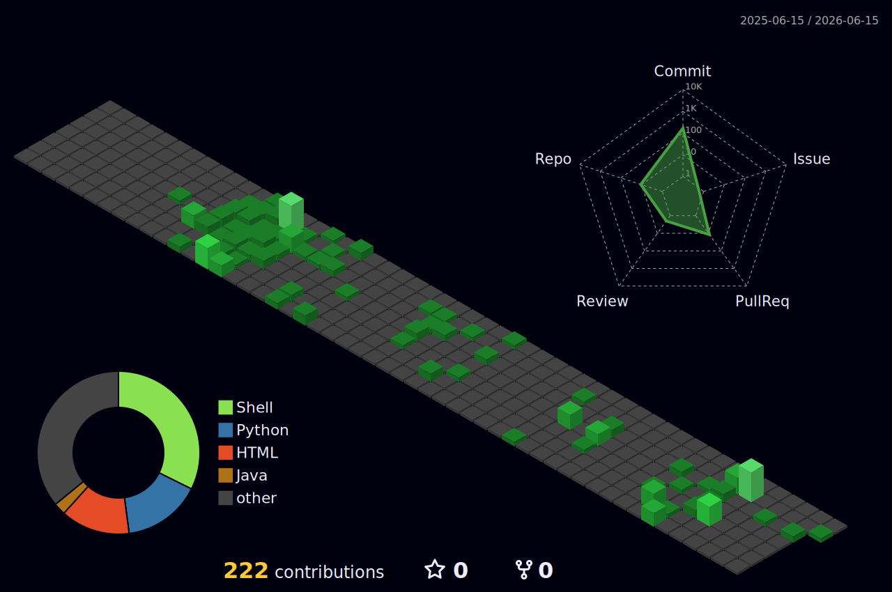

<div align="center">

[](https://git.io/typing-svg)


</div>

<br/>

## 👋 About Me

```bash
#!/bin/bash
# $ whoami

echo "Name     : 유휘영 (Ryu Whi Young)"
echo "School   : 광주소프트웨어마이스터고등학교 · Cloud Computing · Grade 2"
echo "Location : Gwangju, Republic of Korea"
echo "Role     : Cloud Engineer in Training"
echo ""
echo "Learning : AWS SAA · Linux Master"
echo "Interests: Cloud Infrastructure · DevOps · System Optimization"
echo ""
echo "Status   : All systems operational"
```

<br/>

## 🔗 Links

<div align="center">

[](https://velog.io/@whi02)
[](https://www.linkedin.com/in/ryuwhiyoung)
[](https://www.instagram.com/whi02_ryu)

</div>

<br/>

## 📝 Recent Posts

<!-- VELOG_POSTS:START -->
| 제목 | 날짜 |
|------|------|
| 📄 [[CLOUD] Private Subnet EC2와 SSM 통신](https://velog.io/@whi02/CLOUD-Private-Subnet-EC2%EC%99%80-SSM-%ED%86%B5%EC%8B%A0) | 2026. 3. 16. |
| 📄 [[CLOUD] 파일 전송 기술은 어떻게 발전되었는가?](https://velog.io/@whi02/CLOUD-AWS-SCP-VS-S3-Staging) | 2026. 3. 12. |
| 📄 [[CLOUD] AWS ECR과 Docker를 활용한 build & Push](https://velog.io/@whi02/CLOUD-AWS-ECR%EA%B3%BC-Docker%EB%A5%BC-%ED%99%9C%EC%9A%A9%ED%95%9C-build-Push) | 2026. 3. 11. |
| 📄 [[CLOUD] kOps, Evoy Gateway를 이용한 aws 배포](https://velog.io/@whi02/CLOUD-kOps-Evoy-Gateway%EB%A5%BC-%EC%9D%B4%EC%9A%A9%ED%95%9C-aws-%EB%B0%B0%ED%8F%AC) | 2026. 3. 11. |
| 📄 [AWS EBS 볼륨 관리 마스터하기](https://velog.io/@whi02/AWS-EBS-%EB%B3%BC%EB%A5%A8-%EA%B4%80%EB%A6%AC-%EB%A7%88%EC%8A%A4%ED%84%B0%ED%95%98%EA%B8%B0) | 2026. 2. 25. |

<!-- VELOG_POSTS:END -->

<div align="right">

[](https://velog.io/@whi02)

</div>

<br/>

## 🛠 Tech Stack

**Cloud & Infra**


**AWS Services**


**Monitoring & CI/CD**


**Languages & DB**


<br/>

## 📊 GitHub Stats

<div align="center">


</div>

<div align="center">

[](https://git.io/streak-stats)

</div>

<br/>

## 🌱 Contributions

<div align="center">



</div>

<br/>

<div align="center">

[](http://gsm.gen.hs.kr/)


</div>
