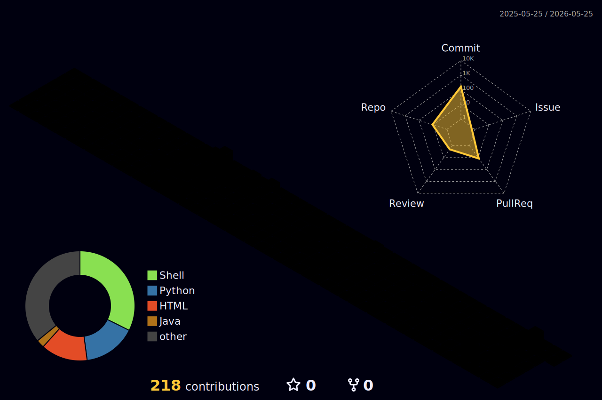

# 안녕하세요! 👋

## 🙋‍♂️ About Me

- 💻 개발을 좋아하는 개발자입니다
- 📝 [Velog](https://velog.io/@whi02)에 기술 블로그를 작성합니다
- 🌱 꾸준히 성장 중입니다

## 🛠 Tech Stack

## 📊 GitHub Stats

## 🎯 3D Contribution Graph

## 📝 Recent Blog Posts

<!-- BLOG-POST-LIST:START -->
<!-- BLOG-POST-LIST:END -->

---

